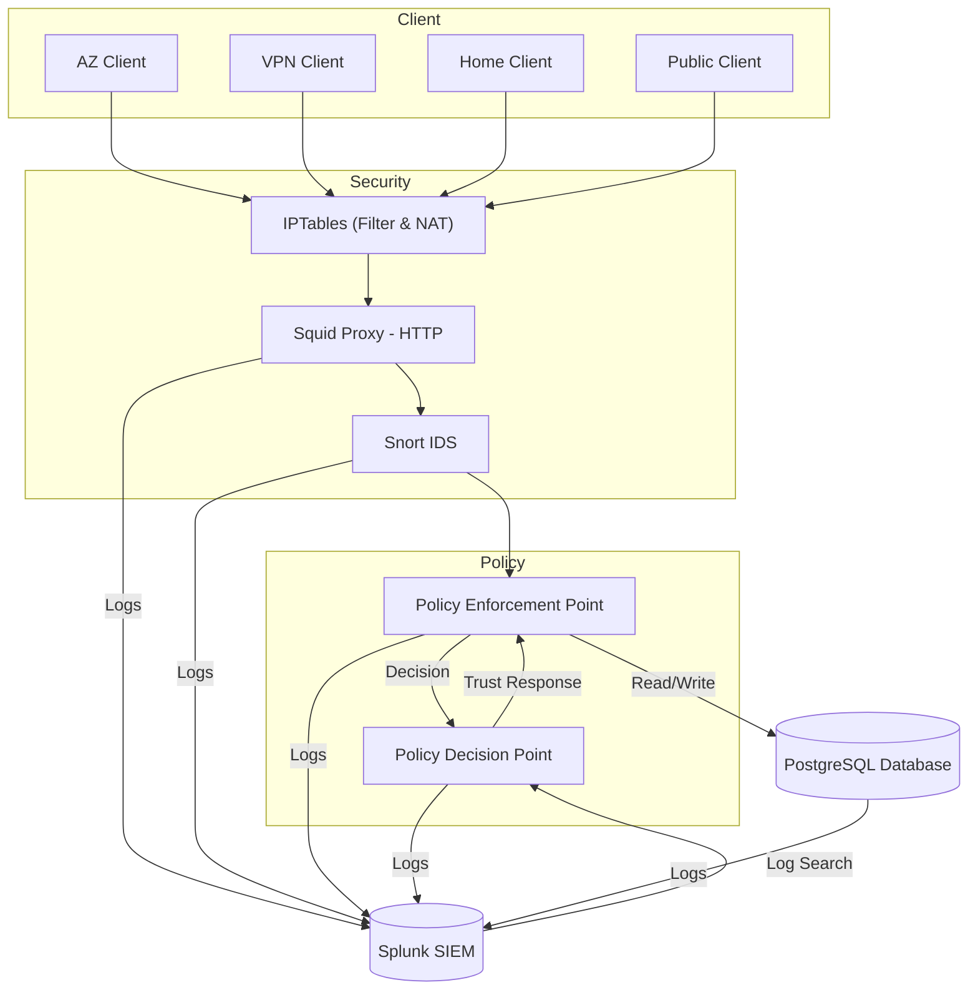

# Zero Trust Architecture

<p align="center">
  
</p>

<p align="center">
  <b>Advanced Cybersecurity for IT</b>  
</p>

<p align="center">
  <a href="#-overview">📘 Project</a> •
  <a href="#-setup">🚀 Setup</a> •
  <a href="#-struttura-delle-cartelle">📂 Struttura</a> •
  <a href="#-tecnologie-usate">🛠️ Tech Stack</a>
</p>

<p align="center">
  
  
  
  
  
  
  
  
</p>

---

## 🧠 Overview

La **Zero Trust Architecture** implementata è un'infrastruttura containerizzata e segmentata, progettata per simulare una rete moderna basata sui principi di **Zero Trust Security**. Le policy che sono state implementate simulano un contesto sanitario, che risulta essere adatto all'implementazione di una ZTA.

L’ambiente è diviso in quattro subnet (*aziendale*, *VPN*, *domestica*, *pubblica*), ognuna con policy, accessi e permessi distinti.

Il sistema prevede:
- **controllo centralizzato degli accessi** tramite PEP (Policy Enforcement Point) e PDP (Policy Decision Point),
- **proxy trasparente** per intercettazione e reindirizzamento,
- **IDS distribuito** con Snort in ascolto multi-interfaccia,
- **logging centralizzato compatibile con Splunk** per tracciabilità e analisi degli eventi.

## 🧩 Architettura a strati


---

## 🛠️ Tecnologie usate

| Componente             | Tecnologia                     |
|------------------------|--------------------------------|
| **Containerization**   | Docker / Docker Compose        |
| **IDS**                | Snort (multi-interfaccia)      |
| **Proxy**              | Squid (trasparente)            |
| **Firewall**           | iptables (NAT, redirect, DoS)  |
| **Access Control**     | Python (Flask)                 |
| **Logging centrale**   | Splunk (via HEC)               |
| **Autenticazione**     | PostgreSQL                     |

---
## 📂 Struttura delle cartelle

```plaintext
ZeroTrustProject/
├── client/ # Script per invio operazioni dai client
│ ├── send_operation.py
│ ├── config.json
│ └──  Dockerfile
├── db/
│ ├── init_tables.sql
│ ├── postgresql.conf
│ ├── seed.py
│ └── Dockerfile.seeder
├── iptables/ # Script di init iptables + forwarding
│ ├── Dockerfile
│ └── ip_start.sh
├── pdp/ # Policy Decision Point
│ ├── app.py
│ └── Dockerfile
├── pep/ # Policy Enforcement Point
│ ├── app.py
│ ├── policies.json
│ └── Dockerfile
├── snort/ # IDS distribuito
│ ├── rules
│       └── local.rules
│ ├── Dockerfile
│ ├── snort_start.sh
│ └── snort.conf
├── splunk/ # SIEM per i log
│ ├── custom-entrypoint.sh
│ ├── Dockerfile
│ ├── indexes.conf
│ ├── inputs.conf
│ └── props.conf
├── squid/ # Proxy HTTP
│ └── squid.conf
├── .env
├── docker-compose.yaml
├──.....
```

---

## 🚀 Setup

> **NB:** L'intero progetto è stato sviluppato e testato in ambiente WSL (Windows Subsystem for Linux); dunque, funziona in ambienti Unix. Non è garantito il funzionamento in ambienti Windows o MacOS. 

1. Clona il progetto

```bash
git clone https://github.com/Arianna6400/ZeroTrustProject
cd ZeroTrustProject
```

2. Crea ```.env``` per variabili sensibili. Si consiglia il posizionamento come spiegato in [Struttura delle cartelle](#-struttura-delle-cartelle).

```bash
POSTGRES_USER=<inserire utente ps>
POSTGRES_PASSWORD=<inserire password ps> 
POSTGRES_DB=<inserire db>

DB_HOST=<inserire host>
DB_PORT=<inserire porta>
DB_NAME=<inserire nome db>
DB_USER=<inserire utente db>
DB_PASSWORD=<inserire password db>

SPLUNK_USERNAME=<inserire utente> # solitamente per l'interfaccia splunk è 'admin'
SPLUNK_PASSWORD=<inserire password>
SPLUNK_HEC_TOKEN=<inserire hec token>
SPLUNK_HOST=<inserire host> # noi consigliamo https://zta_splunk:8089/
SPLUNK_PORT=<inserire porta>

PDP_PORT=<inserire porta>
PEP_PORT=<inserire porta>

PDP_VALUTA=<inserire url> # noi consigliamo http://pdp:8001/valuta

LOG_DIR=/mnt/pdp_logs
LOG_FILE=pdp.log

POLICY_FILE=policies.json
```

3. (*Opzionale*) Nel caso in cui non parta l'IP virtuale, si può risolvere con lo script ```init.sh```.

```bash
chmod +x init.sh
./init.sh
```

3. Avvia l'intero stack. Se si preferisce avere i container in background, utilizzare la flag ```-d```, altrimenti togliere la flag e far partire l'esecuzione visibile su terminale in real time.

```bash
docker compose up -d --build
```

4. Per verificare lo stato dei container.

```bash
docker compose ps
```

5. Per verificare lo stato delle reti, lanciare lo script ```network_checker.sh```. Ricordarsi di rimanere nella directory principale.

```bash
chmod +x network_checker.sh
./network_checker.sh
```

---

## 🧪 Esempi di richiesta Client e risposta Server

Gli esempi che verranno mostrati sono solo due dei tanti possibili. Per verificare correttamente il funzionamento di tutte le *policy* e il relativo *controllo degli accessi*, si possono cambiare i valori dei parametri associati alla richiesta, o cambiare container a seconda della rete che si vuole testare. 

### Accesso concesso

Ecco un esempio di richiesta inviata da un client della rete **aziendale** tramite il comando CLI, con risposta **accesso concesso**:

```bash
docker exec -it client_aziendale \
  python3 /app/send_operation.py \
    --username alice \            # sia username che password possono essere
    --password password123 \      # omesse; in tal caso verrà richiesto l'inserimento da CLI
    --operazione lettura \
    --risorsa "Dati anagrafici pazienti" \
    --dispositivo personale
```

L'output prodotto: 

```bash
🚀 Invio richiesta al PEP...
✅ Status: 200
📦 Risposta:
{
  "accesso": "concesso",
  "dettagli_policy": {
    "livello_fiducia": 0.85,
    "policy_applicata": "Accesso dati sanitari sensibili - lettura in rete aziendale",
    "soglia": 0.85
  },
  "dispositivo": "personale",
  "operazione": "lettura",
  "rete": "aziendale",
  "risorsa": "sensibile",
  "soggetto": "Personale"
}

```

- Relativo log in **Squid**: 

    ```bash
    1753289734.802    968 10.10.1.21 TCP_MISS/200 562 POST http://zta_pep:8002/operazione - HIER_DIRECT/10.10.1.222 application/json
    ```

- Relativa log in **Snort**:

    ```bash
    07/23-18:35:26.304597  [**] [1:3000003:1] ZTA SCAN ICMP verso PEP [**] [Priority: 2] {ICMP} 10.10.1.253 -> 10.10.1.222
    07/23-18:35:26.304597  [**] [1:1000008:1] [ZTA] Pacchetto IP rilevato [**] [Priority: 0] {ICMP} 10.10.1.253 -> 10.10.1.222
    07/23-18:35:26.304815  [**] [1:1000008:1] [ZTA] Pacchetto IP rilevato [**] [Priority: 0] {ICMP} 10.10.1.222 -> 10.10.1.253
    ```

- Relativo log del **PDP**:

    ```bash
    Squid score = 1.00 (deny=0, success=0)
    Snort score = 0.90 (P1=0, P2=1, P3=0)
    PEP score = 1.00 (fail_ip=0, fail_user=0, success_user=0, success_ip=0, bonus=0.00)
    Trust finale calcolata: 0.85
    PDP: Valutazione per {'soggetto': 'Personale', 'rete': 'aziendale', 'dispositivo': 'personale', 'operazione': 'lettura', 'risorsa': 'sensibile', 'ip_client': '10.10.1.21', 'username': 'alice'}: trust=0.85
    10.10.1.222 - - [23/Jul/2025 18:35:26] "POST /valuta HTTP/1.1" 200 -
    ```
- Relativo log del **PEP**:

    ```bash
    [INFO] Richiesta ricevuta: {'username': 'alice', 'password': 'password123', 'operazione': 'lettura', 'risorsa': 'Dati anagrafici pazienti'}
    [INFO] Policy selezionata: Accesso dati sanitari sensibili - lettura in rete aziendale con soglia 0.85
    [INFO] Risposta PDP: fiducia=0.85, soglia=0.85
    [INFO] Utente: alice | IP: 10.10.1.21 | Operazione: lettura su risorsa: Dati anagrafici pazienti | Ruolo: Personale | Accesso: concesso (fiducia=0.87, soglia=0.85)
    [INFO] 10.10.1.253 - - [23/Jul/2025 18:35:26] "POST /operazione HTTP/1.1" 200 -
    ```

### Accesso Negato

Ecco invece un esempio di richiesta inviata da un client della rete **aziendale** tramite il comando CLI, con risposta **accesso negato** a causa del mancato raggiungimento di soglia delle policy:

```bash
docker exec -it client_aziendale \
  python3 /app/send_operation.py \
    --username bob \
    --password password123 \
    --operazione scrittura \
    --risorsa "Cartella Clinica" \
    --rete aziendale \
    --dispositivo personale
```

L'output prodotto: 

```bash
🚀 Invio richiesta al PEP...
✅ Status: 403
📦 Risposta:
{
  "esito": "negato",
  "motivazione": "Nessuna policy applicabile per il contesto richiesto"
}
```

- Relativo log in **Squid**:

  ```bash
  1753295726.439    143 10.10.1.21 TCP_MISS/403 382 POST http://zta_pep:8002/operazione - HIER_DIRECT/10.10.1.222 application/json
  ```
- Relativo log in **Snort**:

  ```bash
  07/23-18:43:56.943249  [**] [1:3000003:1] ZTA SCAN ICMP verso PEP [**] [Priority: 2] {ICMP} 10.10.1.253 -> 10.10.1.222
  07/23-18:43:56.943249  [**] [1:1000008:1] [ZTA] Pacchetto IP rilevato [**] [Priority: 0] {ICMP} 10.10.1.253 -> 10.10.1.222
  07/23-18:43:56.943293  [**] [1:1000008:1] [ZTA] Pacchetto IP rilevato [**] [Priority: 0] {ICMP} 10.10.1.222 -> 10.10.1.253
  ```

- Relativo log del **PEP**:

  ```bash
    [INFO] Richiesta ricevuta: {'username': 'bob', 'password': 'password123', 'operazione': 'scrittura', 'risorsa': 'Cartella Clinica'}
    [WARNING] Nessuna policy applicabile trovata per il contesto: {'soggetto': 'Guest', 'rete': 'aziendale', 'dispositivo': 'personale', 'operazione': 'scrittura', 'risorsa': 'sensibile', 'ip_client': '10.10.1.21', 'username': 'bob'}
    [INFO] Accesso negato - Nessuna policy applicabile per il contesto
    [INFO] 10.10.1.253 - - [23/Jul/2025 18:43:56] "POST /operazione HTTP/1.1" 403 -
  ```

> **NB**: Quando viene negato l'accesso, il PDP non viene attivato, poiché l'Enforcement, non avendo strumenti a disposizione per valutarne l'affidabilità, per l'ottica Zero Trust nei confronti di qualsiasi utente/rete/ruolo, non consente l'accesso e non attiva il trigger del PDP. In questo modo, viene implementato il meccanismo di protezione di *fail safe default*.
---

## 🔐 Note Finali

Il sistema implementato rappresenta una simulazione funzionale e realistica di un'infrastruttura basata su principi Zero Trust. Il progetto mette in evidenza l’integrazione sinergica di tecnologie diverse, coprendo:

- il controllo fine-grained degli accessi, applicando il concetto "*verify everything, trust nothing*", tipico delle ZTA,
- il monitoraggio attivo tramite IDS e proxy,
- la registrazione centralizzata per auditing e analysis.

### 🎯 Obiettivi raggiunti

| ✅ Obiettivo | Descrizione |
|-------------|-------------|
| **Isolamento delle reti** | Le subnet aziendale, VPN, domestica e pubblica sono isolate tra loro. |
| **Accessi basati su contesto** | Le decisioni vengono prese in base a rete, ruolo, dispositivo, operazione e livello di fiducia. |
| **Logging centralizzato** | Tutti i componenti (Squid, Snort, PEP, PDP, DB) loggano su Splunk via HEC. |
| **Rilevamento anomalie** | Snort rileva scansioni TCP/UDP/ICMP (se non bloccati prima, applicando la *defense-in-depth*) |
| **Tracciabilità completa** | Ogni richiesta è tracciata end-to-end con log coerenti su ogni componente. |

---

<p align="center">  
<p align="center"><b>🧠 Zero Trust is not a product — it's a strategy. Questo progetto è un esempio di una sua simulazione realistica.</b></p>

## 👥 Team

|Nome | GitHub |
|-----------|--------|
| 👩 `Agresta Arianna` | [Click here](https://github.com/Arianna6400) |
| 👨 `Biccheri Emanuele` | [Click here](https://github.com/Emanuele1087650) |
| 👨 `Camplese Francesco` | [Click here](https://github.com/FrancescoCamplese00) |
| 👨 `Di Vita Marco` | [Click here](https://github.com/divitamarco) |
| 👨 `Giacconi Alessio` | [Click here](https://github.com/AlessioGiacconi) |
